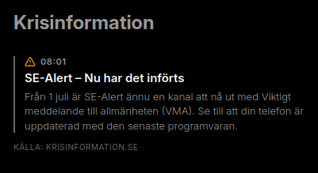

# mirrordash-krisinformation
 
Swedish crisis and societal disruption information from Krisinformation.se
 
## Installation
 
Install in editable mode for local development:
```bash
uv pip install -e .
```

## Running Tests

Run the starter tests using pytest:
```bash
pytest
```

## Configuration & API Keys

Provide instructions here on how to retrieve necessary API keys or other credentials.
* **API Key Retrieval**: (e.g., "Sign up at [Provider Portal](https://example.com) to get your API key.")
* **Setup**: Enter the credentials in the visual configuration editor in the Admin Dashboard.

## Screenshot

Place a preview screenshot of your widget named `screenshot.png` in the root of this module directory. This image will be displayed inside the MirrorDash module store.


